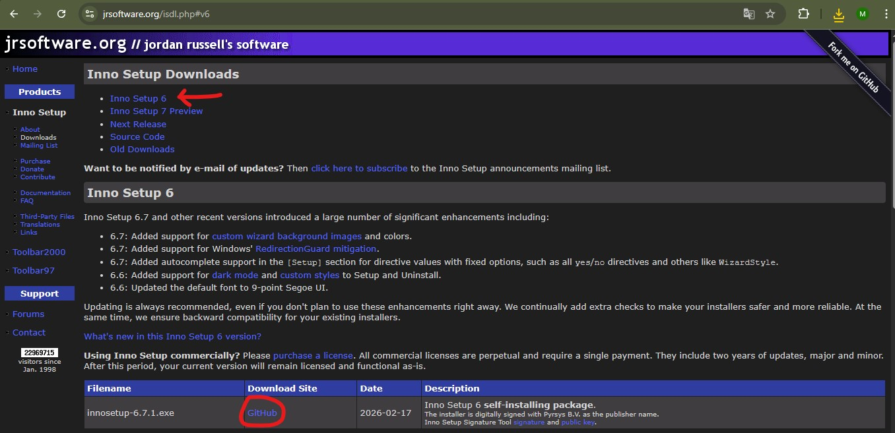

# Générateur de Setup

> **Objectif** : distribuer le fork FlatCAM sous forme d'un installateur Windows autonome (`Automated_FlatCAM_Setup_8.994.exe`), sans que l'utilisateur final n'ait besoin d'installer Python ni aucune dépendance.

## Rôle du script

Après avoir ajouté une fonctionnalité ou apporté une correction au code de Automated FlatCAM, il faut pouvoir créer à nouveau un installateur pour simplifier l'installation du logiciel.

Le dépôt du projet comprend déjà un programme permettant d'automatiser la création d'un installateur simplement en l'exécutant. Cela génère un installateur exécutable (.exe) uniquement compatible avec Windows, permettant d'installer facilement le logiciel sur une autre machine.

## 2. Outils utilisés

### PyInstaller

Pour créer un exécutable à partir du code Python, il faut créer une première version portable du code comprenant un condensé de toutes les dépendances ainsi qu'un exécutable du code Python. Cette première étape est assurée par `PyInstaller`.

**PyInstaller** analyse un script Python et le transforme en un exécutable Windows autonome (`.exe`) en embarquant l'interpréteur Python et toutes les dépendances (DLLs, packages, assets) dans un dossier `dist/`.

- Version utilisée : `6.19.0`
- Installation : `pip install pyinstaller==6.19.0`
- Documentation : https://pyinstaller.org
- Commande de build : `pyinstaller flatcam.spec --clean`

Le comportement de PyInstaller est entièrement contrôlé par le fichier `.spec` présent dans le projet.

**Installez cet outil avec `pip install pyinstaller==6.19.0` dans un terminal avec l'`env310` actif.**

### Inno Setup 6

**Inno Setup** est un outil gratuit de création d'installateurs Windows. Il prend le dossier produit par PyInstaller et le compresse dans un `Setup.exe` professionnel, avec assistant d'installation, raccourcis, associations de fichiers et désinstallateur.

- Version utilisée : `6.x`
- Téléchargement : https://jrsoftware.org/isdl.php
- Commande de build : `iscc.exe flatcam_setup.iss`
- Le comportement est contrôlé par le fichier `.iss`.

**Installez `Inno Setup 6` depuis le [site officiel](https://jrsoftware.org/isdl.php)** 

**ou avec la commande suivante dans le PowerShell Windows :** 
```
winget install -e --id JRSoftware.InnoSetup
```

## Fonctionnement

PyInstaller nécessite un fichier `.spec` détaillé pour FlatCAM en raison de ses nombreuses dépendances géospatiales (GDAL, Rasterio, Shapely, Rtree) et de son architecture à plugins chargés dynamiquement.

**flatcam.spec** : Fichier `.spec` complet crucial pour Pyinstaller contenant :
- `hiddenimports` exhaustif pour tous les modules chargés dynamiquement (plugins, backends VisPy, etc.)
- `datas` incluant tous les assets : icônes, polices, locales, shaders VisPy, préprocessors
- `binaries` pour les DLLs non détectées automatiquement (freetype, GDAL, ortools)
- Détection automatique du dossier `site-packages` de l'environnement actif
- `EXE` : configuration de l'exécutable (icône, mode console, version)
- `COLLECT` : assemblage du dossier `dist/FlatCAM/`

> **Note** : `console=True` activé pour voir les erreurs au lancement pendant la phase de débogage (mettre false pour la version distribuée)


De la même manière que Pyinstaller nécessite un fichier `.spec`, `Inno Setup 6` a besoin d'un `.iss` pour définir un certain nombre de paramètres et d'options. 

**flatcam_setup.iss** : script Inno Setup qui définit le comportement de l'installateur Windows.
- Métadonnées de l'application (nom, version, éditeur, GUID)
- Configuration des langues (FR/EN)
- Liste des fichiers à inclure (pointe vers `dist\FlatCAM\`)
- Définition des raccourcis (Bureau, Menu Démarrer)
- Entrées de registre (association `.FlatPrj`, enregistrement de l'app)
- Options de désinstallation

**Pour mettre à jour la version** : modifiez les lignes `#define` en haut du fichier :
```
#define AppVersion     "8.994"
#define OutputBaseFilename=Automated_FlatCAM_Setup_{#AppVersion}
```

L'entièreté du processus est automatisée à l'aide d'un script.

**build.bat** : script batch Windows qui automatise la chaîne de build complète en une seule commande.
Ses actions sont :

1. Vérifications préliminaires (environnement Python, fichiers présents, Inno Setup installé)
2. Nettoyage des anciens artefacts (`build/`, `dist/`, `Installers/`)
3. Activation de `env310` et lancement de PyInstaller
4. Vérification que `dist\FlatCAM\FlatCAM.exe` existe
5. Lancement d'Inno Setup
6. Vérification que `Installers\Automated_FlatCAM_Setup_8.994.exe` existe
7. Ouverture automatique du dossier `Installers\` dans l'explorateur


**Configuration** : les chemins sont définis en haut du fichier dans la section `CONFIGURATION` :
```batch
set ENV_PATH=..\env310
set INNO_PATH_1=C:\Program Files (x86)\Inno Setup 6\iscc.exe
```

## Utilisation

Une fois avoir installé Pyinstaller et Inno Setup 6, il ne reste plus qu'à utiliser le programme `build.bat`.

Double-clic sur build.bat

ou depuis PowerShell :
```powershell
.\build.bat
```

## Paramètres disponibles

> **NOTE :** Si vous souhaitez travailler avec github.
> **À ajouter dans `.gitignore`** :
> ```
> dist/
> build/
> Installers/
> __pycache__/
> *.pyc
> ```
