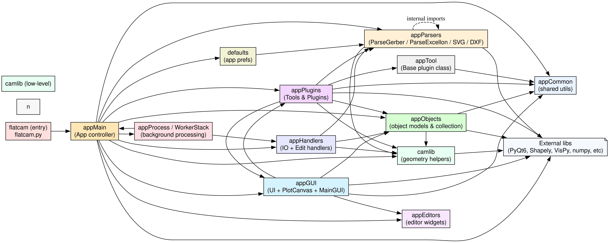

# Le Fork FlatCAM

Ce projet est un fork `github` d'une version de FlatCAM mise à jour notamment compatible avec des dépendances plus récentes (et donc plus pérennes dans le temps).

!!! quote "Qu'est-ce qu'un fork Github?"
    > **GitHub** est une plateforme basée sur le cloud où vous pouvez stocker, partager et travailler avec d'autres pour écrire du code. Le stockage de votre code dans un « référentiel » sur GitHub vous permet de : 
        - Présenter ou partager votre travail. 
        - Suivre et gérer les modifications apportées à votre code au fil du temps.
    Notez que GitHub repose sur Git qui est un logiciel de contrôle de version utilisé par les développeur comme la norme.
    > Votre fork contient une copie du dépôt du projet d'origine et certains paramètres du projet, mais pas son contenu comme les issues, pull request ou les pages wiki.

    ---

    **Source** : 

## Pourquoi un fork ?

Le fork me permet de reprendre le projet flatcam et d'y ajouter un plugin pour notre utilisation, fait sur mesure, directement au sein du code.

Le projet FlatCAM copié est une copie du repo de [Dwrobel](https://github.com/dwrobel/flatcam) qui apporte des légères mises à jour au logiciel.

## Ce qui diffère de FlatCAM upstream

Cette version fork de FlatCAM est totalement identique au logiciel flatCAM vu que s'en est littéralement une copie. La seule différence est l'insertion du plugin `ToolAutomated`.

## Architecture générale du code

Schéma graphviz des liens entre les pages du projet.

Le fichier contenant le code du Plugin `Automated` se trouve dans `appPlugins/ToolAutomated.py`.

Il contient à l'instar des autres plugins deux 
classes principales, une classe `AutoUI` en charge de l'affichage de l'interface du plugin et la classe `ToolAutomated` contenant toutes les fonctions propres aux opérations et actions du plugins.

→ Voir le [Code annoté](code-annote.md) pour le détail de chaque module.
