# Guide d'utilisation avancée — FlatCAM Fork

> ## Prérequis

> → Avoir suivi le [Guide Débutant](guide-debutant.md)

## Tutoriel Vidéo

!!! tip "Tutoriel vidéo"
    *(Lien ou intégration à ajouter ici)*

---

## Configurations avancées

Automated FlatCAM permet d'automatiser la conversion des fichiers gerber et excellon selon une configuration par défaut qui regroupe un certain nombre de paramètres jugés optimaux pour un usinage de PCB classique.
Il est possible de créer sa propre configuration et de la sauvegarder. 
Ce guide d'utilisation avancée a pour but d'expliquer comment créer ou modifier une configuration en détaillant chaque paramètre du panneau `Avancé`.

D'autres options sont également accessibles via le mode avancé et décrites sur cette page.

## Grandes étapes

Dans la grande majorité des cas, le mode avancé servira à créer des trous d'alignement pour réaliser des PCB doubles faces avec précision.

### Ouvrir le plugin Auto en mode avancé dans FlatCAM 

Cliquez sur l'icône Auto, pour ouvrir le plugin Automated FlatCAM. 

Il est également possible d'ouvrir le plugin en allant dans le menu : "Plugins>Conversion Automatisé"

Une fois ouvert vous devez voir à l'écran le nom du plugin, en l'occurence "Conversion Automatisé", ainsi que `Débutant` d'affiché en vert en haut à droite.

Cliquez une fois sur le bouton `Débutant`. Vous devriez maintenant voir `Avancé` d'affiché en rouge.

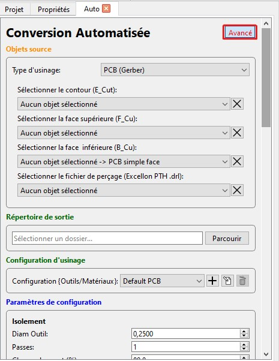

### Charger fichiers Gerber

Dans le coin supérieur gauche du logiciel, cliquez sur l'icône `Gerber` permettant d'ouvrir des objets Gerber. Si vous ne voyez pas cet icône allez dans `Fichier>Ouvrir>Ouvrir Gerber...` (ou `Ctrl + G`).

### Charger fichiers de perçage Excellon

Dans le coin supérieur gauche du logiciel, cliquez sur l'icône `Excellon` (à droite de Gerber) permettant d'ouvrir des objets excellons. Si vous ne voyez pas cet icône allez dans `Fichier>Ouvrir>Ouvrir Excellon...` (ou `Ctrl + E`).

### Sélectioner Workflow PCB (Gerber)

Dans la première section Objets source :

Pour convertir des fichiers Gerber (et potentiellement Excellon) pour un PCB, assurez vous d'avoir sélectionné le type d'usinage : `PCB (Gerber)`

### Sélectionner vos fichiers

Puis, toujours dans la section `Objets source`, vous devez sélectionner les objets à convertir.

Le fichier de contour (souvent appelé `Edge_Cut`) ainsi que le fichier de la face supérieure (souvent appelé `F_Cu`) sont obligatoires.

Sélectionnez dans le premier champs l'objet correspondant au contour, dans le deuxième champs l'objet correspondant à la face supérieure. Pour un simple face, ne rien sélectionner.

Si vous souhaitez rélaiser un PCB doule face il vous faudra fournir la face inférieure. Sélectionnez-la dans le troisième champs.

Si votre PCB comprend des trous de perçage, sléectionnez l'objet Excellon que vous avez préalablement chargé.

> **Note :** Pour annuler une sélection cliquez sur la croix à droite de chaque boite de sélection.

### Sélectionner le répertoire de sortie

Les fichiers convertis en GCODE sont enregistrés dans un répertoire sur votre ordinateur. Il vous faut donc sélectionner une chemin.
Le fichiers g-code pour les trous d'alignement sera également enregistré à ce chemin.

Dans la section " Répertoire de sortie ", cliquez sur `Parcourir` et sélectionner un dossier sur votre ordinateur.

Les fichiers G-CODE permettant l'usinage sur la CNC seront enregistrés dans ce dossier.

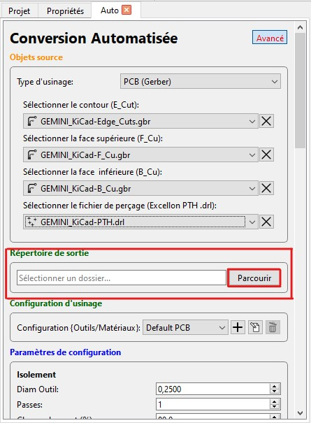

### Sélectionner la configuration d'usinage

La Section Configuration d'usinage permet de choisir une configuration d'usinage particulière.

Une configuration comprends les paramètres et options suivants:

- Paramètres d'isolement :
    - Diamètre d'outil, 
    - Passes, 
    - Chevauchement, 
    - Combinaison, 
    - Type d'isolement
- Paramètres de la tâche CNC :
    -Diamètre d'outil, 
    - Profondeur de coupe, 
    - Hauteur de déplacement, 
    - Vitesse de déplacement, 
    - Vitesse de déplacement axe Z, 
    - Hauteur de Fin, 
    - Vitesse de rotation de la broche, 
    - Temps d'arrêt, 
    - Préprocesseur
- Paramètres de perçage :
    - Diamètres de perçage, 
    - Profondeur de perçage, 
    - Profondeur par pas, 
    - Déplacement en Z, 
    - Vitesse de déplacement axe Z, 
    - Vitesse de broche, 
    - Préprocesseur, 
    - Changement d'outil et Hauteur de changement d'outil

Par défaut, une configuration pour PCB est sélectionnée. S'assurer de bien avoir `Default PCB` de sélectionné ou une autre configuration spéciale pour usiner des PCB.

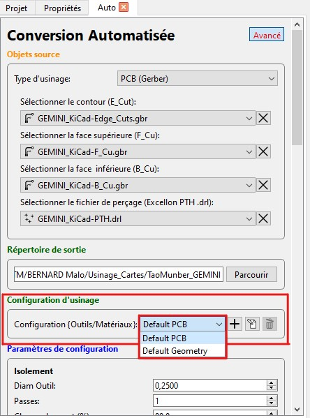

### Paramètres de configuration

Cette section du mode `Avancé` permet de modifier, créer ou supprimer des configurations complètes.

Les paramètres pour les 3 types d'opérations sont affichés et modifiables.

Les configurations par défaut sont inchangeable et ne peuvent être supprimées.

Dans la section `Configuration d'usinage` juste au dessus se trouvent les boutons d'actions.

Le bouton + permet de créer une nouvelle configuration.

Une fois pressé la pop up suivante apparaît pour vous permettre de rentrer le nom de la configuration.

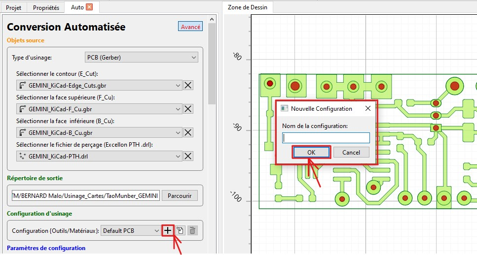

Rentrez le nom et pressez `OK`. Par défaut les paramètres de cette nouvelle configuration correspondent aux paramètres de la configuration `Default PCB`.

Pour modifier les paramètres, changez la valeur d'un ou plusieurs paramètres puis cliquez sur l'icône edit.

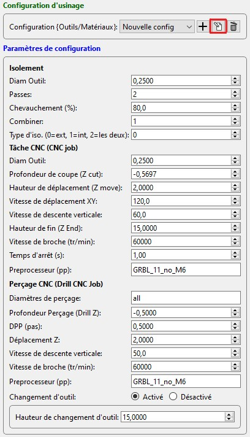

Enfin, vous pouvez supprimer une configuration (autre qu'une config par défaut) en la sélectionnant dans `Configuration d'usinage` puis en cliquant sur l'icône poubelle.

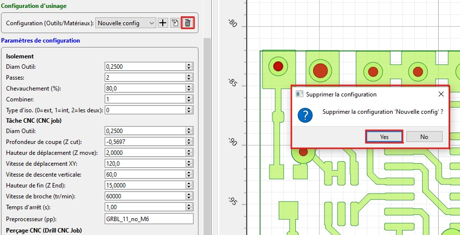

### Calculer les valeurs limites

La section `Valeurs limites` permet de calculer les coordonnées des points correspondant aux valeurs limites ou au centre du contour de votre objet. Ces coordonnées sont utiles pour certaines opérations des sections `Miroir Opération` et `Alignement PCB`.

Cliquez une fois sur le bouton `Calculer les valeurs limites` puis une fois sur le bouton `Centroïde` pour utiliser les coordonnées du centre du contour de votre objet pour la suite.

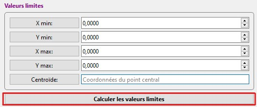

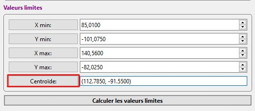

### Miroir Opération

Cet outil sert à mettre en miroir les objets que vous sélectionnez selon l'axe X, Y et/ou en fonction d'une référence qui peut être un point, le contour (Box) de l'objet ou des trous de perçage (Accroche).

Par défaut l'opération de mise en miroir à pour référence le contour  (Box) et l'axe Y. Car lors de la conversion la face inférieure est mise en miroir selon le contour et l'axe Y. Les paramètres par défauts permettent de remettre la face inférieur dans le bon sens.

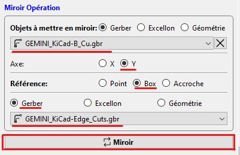

> **Note** : Si vous souhaitez mettre en miroir la couche inférieur car vous réalisez un PCB double face vous n'avez pas besoin d'utiliser cette section. La couche inférieur est automatiquement retournée pour permettre l'usinage double face. 

### Alignement PCB

Cet outil permet de créer un fichier de perçage pour les trous d'alignement de votre carte.

Par défaut le diamètre de forage est de 2mm, en type Y avec la référence à `Box centroid` si vous avez suivi les consignes de la partie [calcul des valeurs limites](#calculer-les-valeurs-limites).

Il est important de comprendre que les trous d'alignement permettent de retourner la carte pour réaliser la face inférieure dans le cas dun PCB double face. Cela implique que les trous soient symétriques selon le même axe par rapport auquel la couche inférieure à subit sa symétrie. Dans notre cas, la symétrie se fait par rapport à l'axe Y (sélectionné ici par défaut).

Pour choisir les coordonnées de perçage il vous suffit dans l'onglet de la zone de dessin de cliquer à un endroit puis de cliquer sur le bouton `Ajouter` pour que les coordonnées de l'emplacement où vous avez cliqué soit ajouté. Vous pouvez ajouter plusieurs points en répetant cette opération.

> **Note** : Un CTRL+Clic sur la Zone de dessin réinitialise votre copie des coordonnées.

De préférence ne choisissez que 2 point d'un coté de votre objet un peu près au même coordonnées sur l'axe X car ces poins sélectionnés seront dupliqué symétriquement par rapport à l'axe Y pour assurer la symétrie.

Ci dessous un exemple de l'opération d'Alignement:

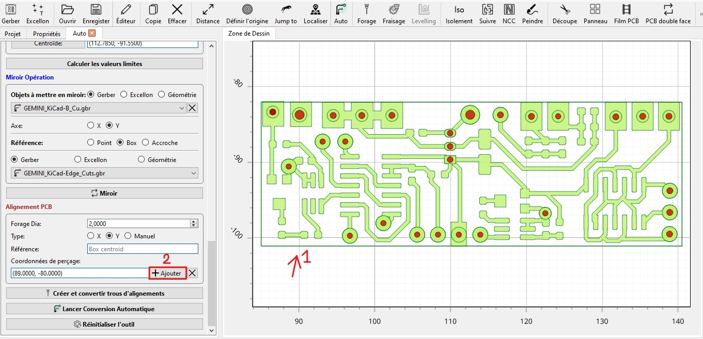

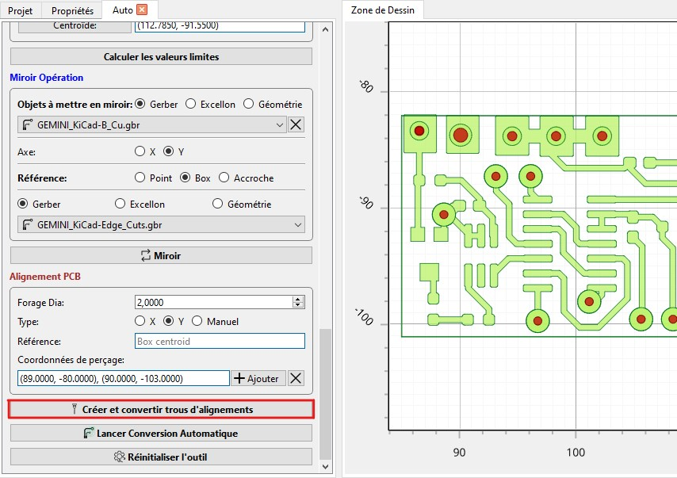

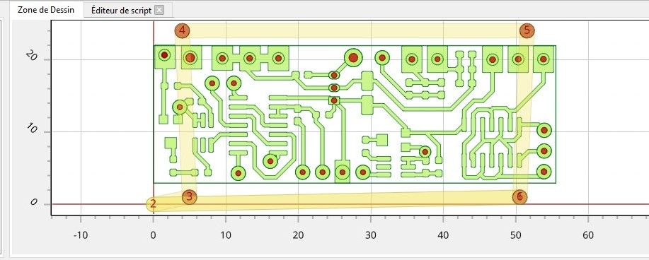

Une fois avoir sélectionné les points et vérifié les paramètres cliquez sur `Créer et convertir trous d'alignements` pour créer le fichier de perçage excellon d'alignement, le convertir en g-code et le sauvegarder à l'emplacement choisis.

### Lancer Conversion Automatique

Une fois avoir suivi scrupuleusement les étapes précédentes, vous pouvez lancer la conversion Automatique.

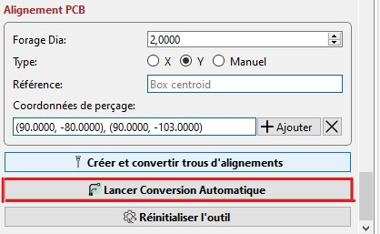

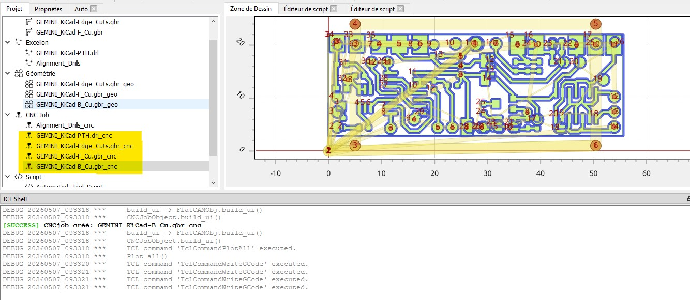

## Paramètres GRBL spécifiques

→ Voir aussi : [Outils & Matériaux](../../cnc/outils-materiaux.md) pour les réglages de vitesse et profondeur.

## Importer dans OpenBuilds Control

→ Étape suivante : [OpenBuilds Control](../openbuilds-control.md)