# Guide d'utilisation facile — FlatCAM Fork

Ce guide d'utilisation vous accompagne pour convertir simplement vos fichiers `GERBER` en fichiers `GCODE` en utilisant Automated FlatCAM. De l'ouverture du logiciel jusqu'à la récupération des GCODE, en passant par la manipulation du plugin `Automated`, ce guide vous accompagne à toutes les étapes.

> ## Prérequis

> → Avoir exporté les fichiers `Gerber` et `Excellon` depuis [KiCad](../kicad.md)

> → Ou avoir exporté son fichier `SVG`.

> → Avoir installé Automated FlatCAM en suivant l'aide de [la page principale](index.md#installation-du-logiciel)

> → IL NE DOIT Y AVOIR AUCUN ESPACE DANS LE NOM DE VOS FICHIERS.

## Tutoriel Vidéo

!!! tip "Tutoriel vidéo"
    

---

## Première ouverture

Ouvrez le logiciel Automated FlatCAM à l'aide du raccourci sur votre bureau ou en cherchant `Automated FlatCAM` dans la barre de recherche du menu démarrer.

### Ouvrir le plugin Auto dans FlatCAM

Cliquez sur l'icône Auto pour ouvrir le plugin Automated FlatCAM. 

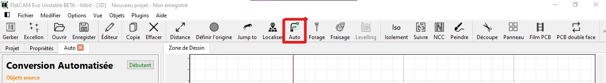

Il est également possible de l'ouvrir en allant dans le menu : "Plugins > Conversion Automatisée"

Une fois ouvert, vous devez voir à l'écran le nom du plugin, en l'occurrence "Conversion Automatisée", ainsi que `Débutant` affiché en vert en haut à droite.

## Usiner un PCB

### Importer un fichier Gerber

Dans le coin supérieur gauche du logiciel, cliquez sur l'icône `Gerber` permettant d'ouvrir des objets Gerber. Si vous ne voyez pas cette icône, allez dans `Fichier > Ouvrir > Ouvrir Gerber...` (ou `Ctrl + G`).

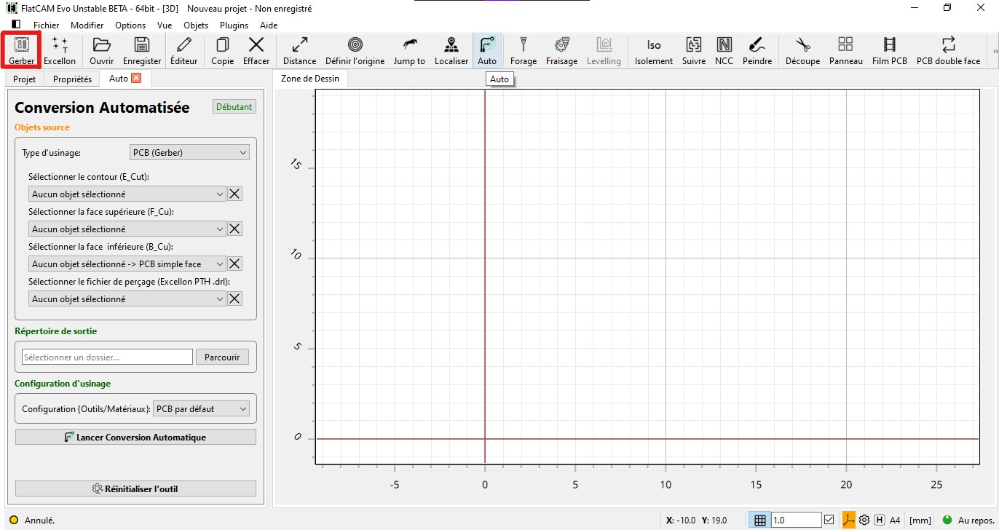

### Importer un fichier de perçage Excellon

Dans le coin supérieur gauche du logiciel, cliquez sur l'icône `Excellon` (à droite de Gerber) permettant d'ouvrir des objets Excellon. Si vous ne voyez pas cette icône, allez dans `Fichier > Ouvrir > Ouvrir Excellon...` (ou `Ctrl + E`).

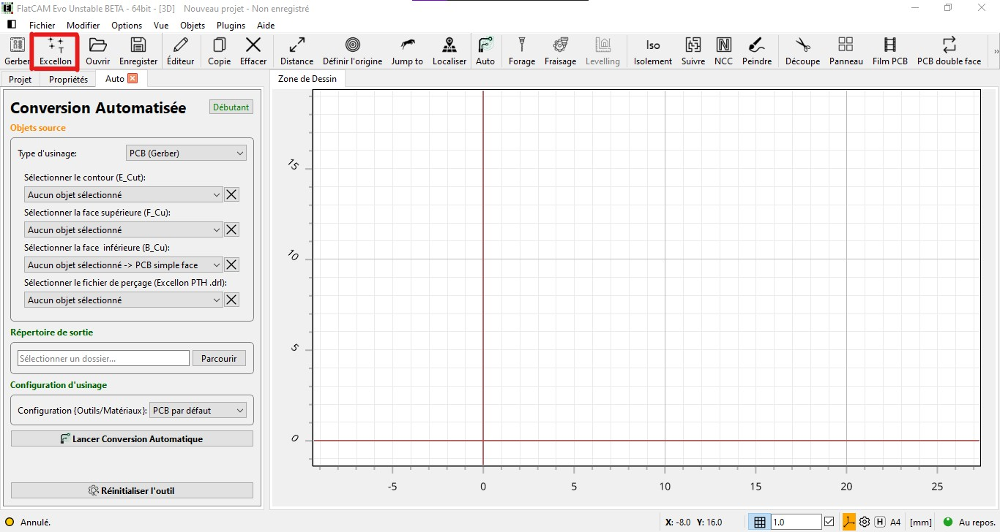

### Sélectionner le Workflow PCB (Gerber)

Dans la première section Objets source :

Pour convertir des fichiers Gerber (et potentiellement Excellon) pour un PCB, assurez-vous d'avoir sélectionné le type d'usinage : `PCB (Gerber)`

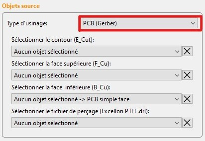

### Sélectionner vos fichiers

Puis, toujours dans la section `Objets source`, vous devez sélectionner les objets à convertir.

Le fichier de contour (souvent appelé `Edge_Cut`) ainsi que le fichier de la face supérieure (souvent appelé `F_Cu`) sont obligatoires.

Sélectionnez dans le premier champ l'objet correspondant au contour, et dans le deuxième champ l'objet correspondant à la face supérieure. Pour un simple face, ne rien sélectionner dans les autres champs.

Si vous souhaitez réaliser un PCB double face, il vous faudra fournir la face inférieure. Sélectionnez-la dans le troisième champ.

Si votre PCB comprend des trous de perçage, sélectionnez l'objet Excellon que vous avez préalablement chargé.

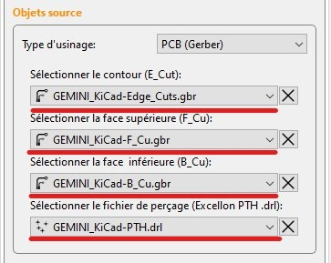

> **Note :** Pour annuler une sélection, cliquez sur la croix à droite de chaque boîte de sélection.

### Sélectionner le répertoire de sortie

Les fichiers convertis en GCODE sont enregistrés dans un répertoire sur votre ordinateur. Il vous faut donc sélectionner un chemin.

Dans la section "Répertoire de sortie", cliquez sur `Parcourir` et sélectionnez un dossier sur votre ordinateur.

Les fichiers GCODE permettant l'usinage sur la CNC seront enregistrés dans ce dossier.

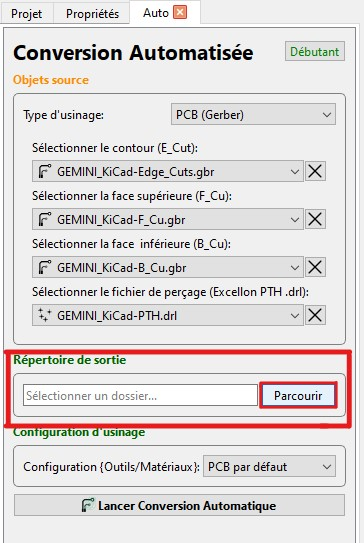

### Sélectionner la configuration d'usinage

La section Configuration d'usinage permet de choisir une configuration d'usinage particulière.

Une configuration comprend les paramètres et options suivants :

- Paramètres d'isolement :
    - Diamètre d'outil, 
    - Passes, 
    - Chevauchement, 
    - Combinaison, 
    - Type d'isolement
- Paramètres de la tâche CNC :
    - Diamètre d'outil, 
    - Profondeur de coupe, 
    - Hauteur de déplacement, 
    - Vitesse de déplacement, 
    - Vitesse de déplacement axe Z, 
    - Hauteur de fin, 
    - Vitesse de rotation de la broche, 
    - Temps d'arrêt, 
    - Préprocesseur
- Paramètres de perçage :
    - Diamètres de perçage, 
    - Profondeur de perçage, 
    - Profondeur par pas, 
    - Déplacement en Z, 
    - Vitesse de déplacement axe Z, 
    - Vitesse de broche, 
    - Préprocesseur, 
    - Changement d'outil et Hauteur de changement d'outil

Par défaut, une configuration pour PCB est sélectionnée. S'assurer de bien avoir `Default PCB` de sélectionné ou une autre configuration spéciale pour usiner des PCB.

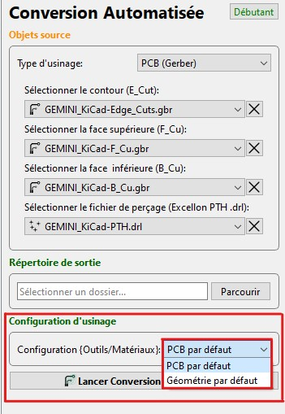

### Lancer l'automatisation

Si les étapes précédentes ont été bien respectées, il vous suffit de cliquer sur `Lancer Conversion Automatique`.

Une fenêtre `Éditeur de Script` ainsi que le terminal s'ouvrent, ce qui est parfaitement normal. Après quelques instants, si plus aucune commande ou information n'est affichée sur le terminal, vous pouvez cliquer à nouveau sur la fenêtre `Zone de Dessin` pour vérifier visuellement la bonne création des GCODE. Vous pouvez retrouver ces derniers dans le répertoire que vous avez sélectionné.

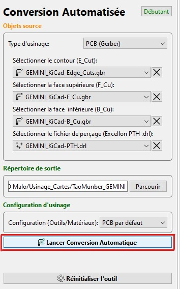

Une fois fini :

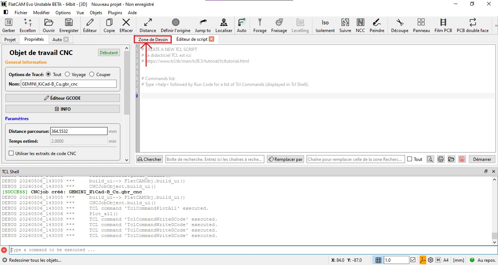

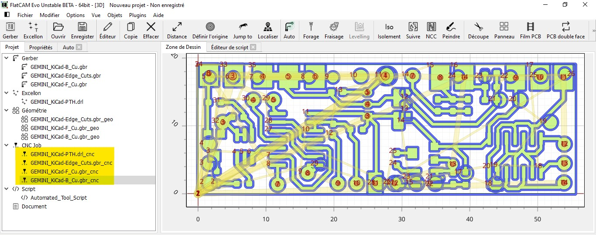

Les géométries et les objets G-code ont été générés. La face inférieure a été mise en miroir selon Y pour permettre l'usinage. Les objets G-code surlignés en jaune ont déjà été enregistrés à l'emplacement indiqué dans la section `Répertoire de sortie`.

## Vous souhaitez usiner un dessin/logo/géométrie

Pour usiner une forme, un dessin ou des géométries sur certains matériaux, veuillez suivre les étapes suivantes.

### Importer un fichier SVG

Dans le coin supérieur gauche du logiciel, cliquez sur `Fichier > Importation > SVG comme Géométrie...`.

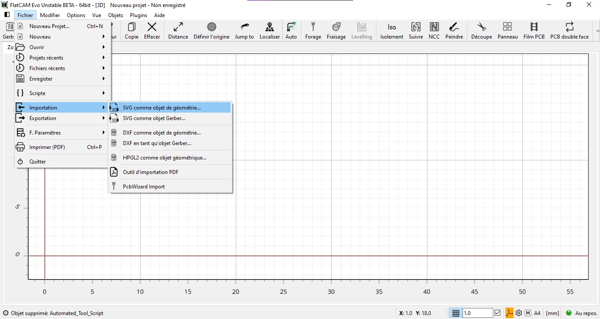

### Importer un fichier de perçage Excellon

Dans le coin supérieur gauche du logiciel, cliquez sur l'icône `Excellon` (à droite de Gerber) permettant d'ouvrir des objets Excellon. Si vous ne voyez pas cette icône, allez dans `Fichier > Ouvrir > Ouvrir Excellon...` (ou `Ctrl + E`).

### Sélectionner le Workflow SVG (Geometry)

Dans la première section Objets source :

Pour convertir des fichiers SVG (et potentiellement Excellon) pour une géométrie ou une forme, assurez-vous d'avoir sélectionné le type d'usinage : `SVG (Geometry)`

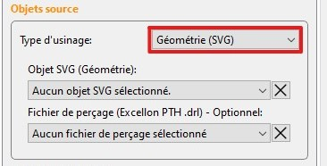

### Sélectionner vos fichiers

La sélection du type d'usinage SVG ne vous permet plus que de sélectionner un objet de type géométrie et potentiellement un fichier de perçage.

Sélectionnez donc les objets dans les listes déroulantes après avoir importé vos fichiers.

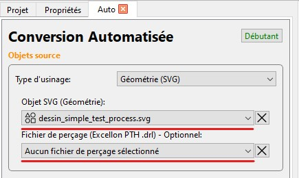

### Sélectionner le répertoire de sortie

Les fichiers convertis en GCODE sont enregistrés dans un répertoire sur votre ordinateur. Il vous faut donc sélectionner un chemin.

Dans la section "Répertoire de sortie", cliquez sur `Parcourir` et sélectionnez un dossier sur votre ordinateur.

Les fichiers GCODE permettant l'usinage sur la CNC seront enregistrés dans ce dossier.

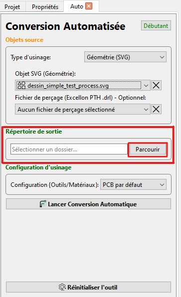

### Sélectionner votre configuration d'usinage

La section Configuration d'usinage permet de choisir une configuration d'usinage particulière.

Une configuration comprend les paramètres et options suivants :

- Paramètres de la tâche CNC :
    - Diamètre d'outil, 
    - Profondeur de coupe, 
    - Hauteur de déplacement, 
    - Vitesse de déplacement, 
    - Vitesse de déplacement axe Z, 
    - Hauteur de fin, 
    - Vitesse de rotation de la broche, 
    - Temps d'arrêt, 
    - Préprocesseur
- Paramètres de perçage :
    - Diamètres de perçage, 
    - Profondeur de perçage, 
    - Profondeur par pas, 
    - Déplacement en Z, 
    - Vitesse de déplacement axe Z, 
    - Vitesse de broche, 
    - Préprocesseur, 
    - Changement d'outil et Hauteur de changement d'outil

Par défaut, une configuration pour PCB est sélectionnée. S'assurer de bien avoir `Default Geometry` de sélectionné ou une autre configuration spéciale pour usiner des dessins ou des formes 2D.

> **Note :** Il est important de noter que les fichiers SVG, étant importés directement comme géométrie, ne subissent pas d'opération d'isolement et que seuls les paramètres de configuration liés à la tâche CNC (CNC Job) sont importants (car c'est la seule opération de conversion). Les paramètres de perçage sont importants également si un fichier de perçage (Excellon) est inséré.

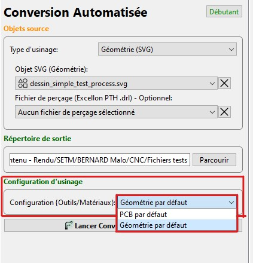

### Lancer l'automatisation

Si les étapes précédentes ont été bien respectées, il vous suffit de cliquer sur `Lancer Conversion Automatique`.

Une fenêtre `Éditeur de Script` ainsi que le terminal s'ouvrent, ce qui est parfaitement normal. Après quelques instants, si plus aucune commande ou information n'est affichée sur le terminal, vous pouvez cliquer à nouveau sur la fenêtre `Zone de Dessin` pour vérifier visuellement la bonne création des GCODE. Vous pouvez retrouver ces derniers dans le répertoire que vous avez sélectionné.

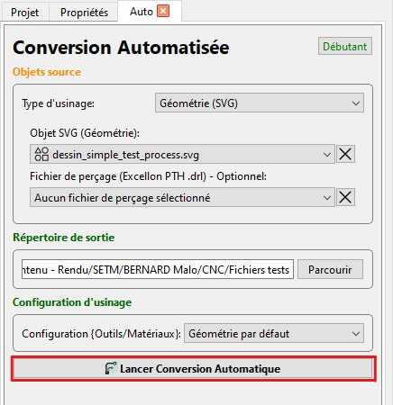

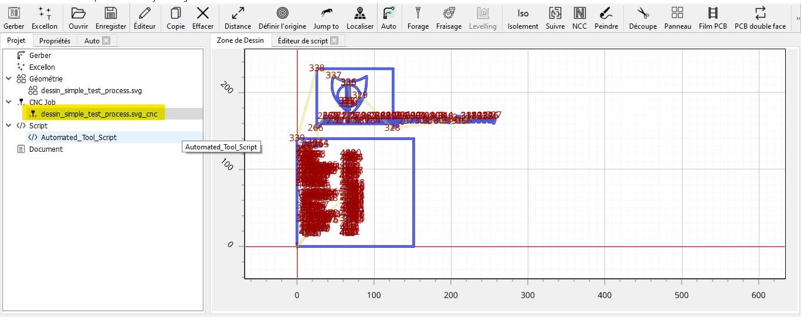

## Importer dans OpenBuilds Control

Il ne reste plus qu'à importer les fichiers GCODE dans OpenBuilds Control et à préparer la CNC pour un usinage.

[Lien vers le guide d'utilisation d'OpenBuilds Control.](../openbuilds-control.md) 

---

→ Étape suivante : [OpenBuilds Control](../openbuilds-control.md)