# FlatCAM Fork

## Rôle

FlatCAM est le logiciel sélectionné pour convertir les fichiers Gerber exportés depuis KiCAD en fichiers d'usinage GCODE contenant des commandes exploitables par le contrôleur de la machine CNC.

!!! quote "Extrait de [flatcam.org](http://flatcam.org)"
    > PCB milling, also known as mechanical etching, is the fastest, cleanest, high-performance and economical PCB prototyping process today.
    > **FlatCAM** : FlatCAM lets you take your designs to a CNC router. You can open Gerber, Excellon or G-code, edit it or create from scratch, and output G-Code. Isolation routing is one of many tasks that FlatCAM is perfect for. It is open source, written in Python and runs smoothly on most platforms. Check out the features list.
    > FlatCAM is open source and it has a [public repository](https://bitbucket.org/jpcgt/flatcam/src/master/)
    ---

    **Source** : [FlatCAM](http://flatcam.org) et [Developing FlatCAM](http://flatcam.org/development) (consulté le 10 avril 2026)

Ce logiciel est très complet et demande un certain temps de prise en main. Le Fork FlatCAM a été réalisé pour apporter des modifications au logiciel en automatisant et en simplifiant la conversion de Gerber vers GCODE.

## Dans cette section

| Page | Contenu |
|---|---|
| [Guide Débutant](guide-debutant.md) | Guide d'utilisation essentiel |
| [Guide Avancé](guide-avance.md) | Fonctions avancées, configurations spécifiques |
| [Le Fork FlatCAM](fork-explication.md) | Pourquoi ce fork, ce qui diffère de la version officielle |
| [Installation du code](installation-dev.md) | Mise en place de l'environnement de développement |
| [Code annoté](code-annote.md) | Source commentée module par module |
| [Générateur de setup](generateur-setup.md) | Fonctionnement du script de génération de setup |

## Installation du logiciel

L'installation du logiciel FlatCAM version Automated s'effectue à l'aide de l'installateur `Automated_FlatCAM_Setup_8.994.exe` qui vous a été fourni en même temps que cette documentation ou qui est téléchargeable **ici**.

L'installateur n'installe que la version opérationnelle de FlatCAM Automatisé sous forme d'une application exécutable.

Si vous souhaitez installer le code de FlatCAM Automatisé pour y apporter des modifications ou autre, veuillez vous référer à la page [d'installation de l'environnement et du code de FLATCAM Automatisé](installation-dev.md).

### Prérequis

---
FlatCAM Fork a été développé et testé uniquement sur Windows 10 et Windows 11. Même si FlatCAM est compatible avec Linux, l'installateur fourni ne permet l'installation de FlatCAM automatisé que sur Windows.

Fonctionne sur :

> PC TEST    
    Processeur	Intel(R) Pentium(R) CPU 4405U @ 2.10GHz   2.11 GHz
    Mémoire RAM installée	8,00 Go (7,90 Go utilisable)
    Stockage	238 GB SSD SAMSUNG MZ7LN256HMJP-000H1
    Carte graphique	Intel(R) HD Graphics 510 (128 MB)
    Type du système	Système d’exploitation 64 bits, processeur x64
    

> PC DÉVELOPPEMENT
    Processeur	Intel(R) Core(TM) i5-3320M CPU @ 2.60GHz   2.60 GHz
    Mémoire RAM installée	16,0 Go (15,8 Go utilisable)
    Stockage	932 GB SSD CT1000MX500SSD1
    Carte graphique	Intel(R) HD Graphics 4000 (32 MB)
    Type du système	Système d’exploitation 64 bits, processeur x64
    Version OS : Microsoft Windows [version 10.0.19045.6466]

### Étapes d'installation

---

Lancez l'exécutable et suivez les étapes suivantes.

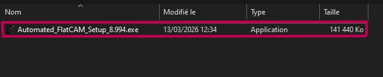

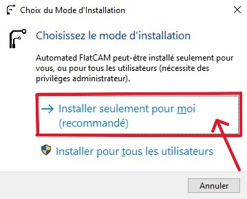

Suivez les recommandations de l'installateur.

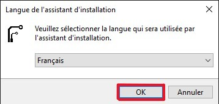

Seuls le français et l'anglais sont complets pour cette version de FlatCAM.  

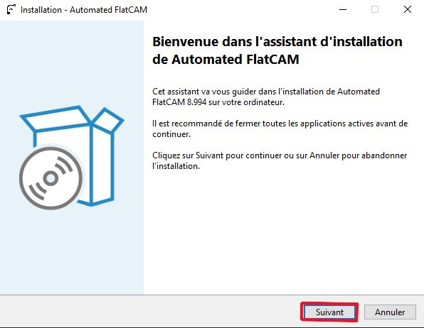

Démarrage de l'assistant d'installation. Appuyez sur `Suivant`.

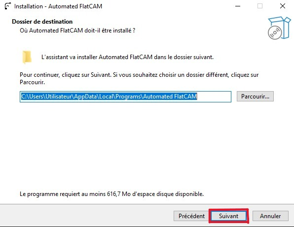

Chemins d'installation du logiciel. Laissez le chemin par défaut proposé et appuyez sur `Suivant`.

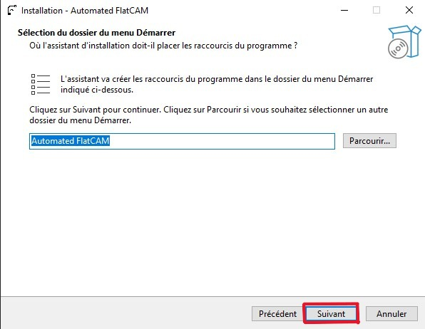

Appuyez sur `Suivant`.

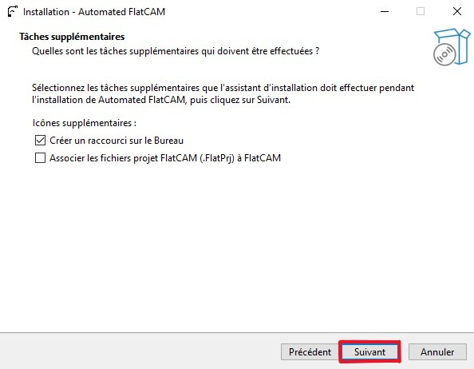

Vous avez la possibilité de créer un raccourci sur le Bureau (coché par défaut). Si cette installation est la seule version de FlatCAM sur votre machine, vous pouvez également cocher la deuxième option. Les extensions de fichier `.FlatPrj` seront associées à cette application.

Appuyez sur `Suivant`.

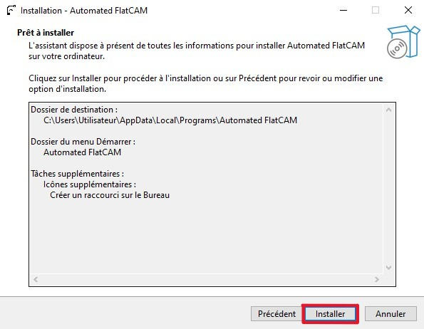

Appuyez sur `Installer` pour lancer l'installation.

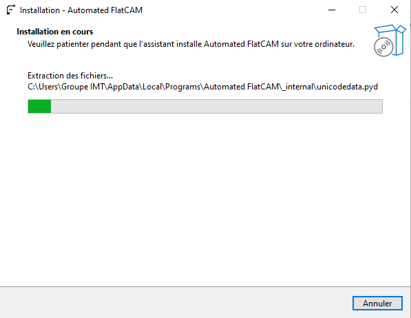

Automated FlatCAM est en cours d'installation ...

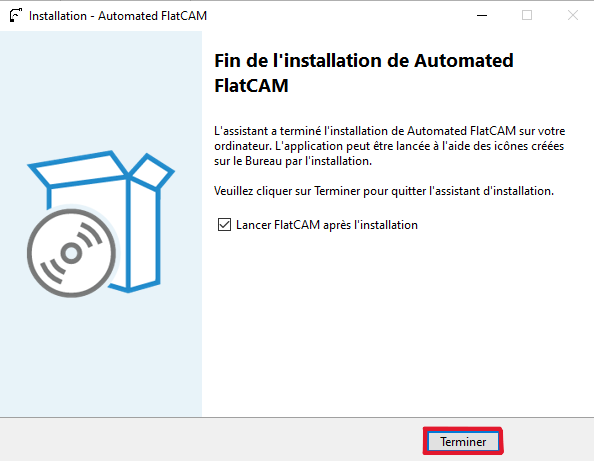

L'installation est terminée, vous pouvez fermer l'installateur et lancer FlatCAM via le raccourci sur le bureau ou via le menu Démarrer.

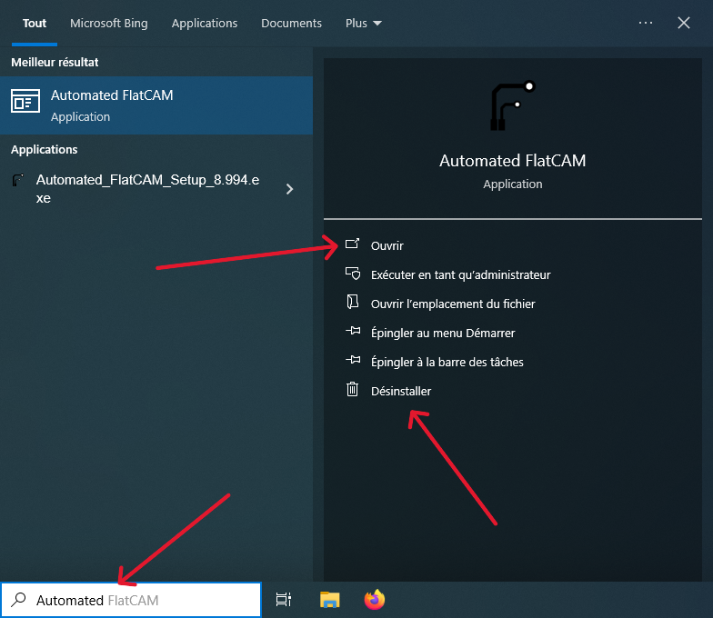

>**Note :** Vous pouvez également désinstaller proprement le logiciel, un désinstallateur (uninstaller) est créé par l'installateur.

--------------------------------------------------------------

[→ Étape suivante : Guide du débutant](guide-debutant.md)