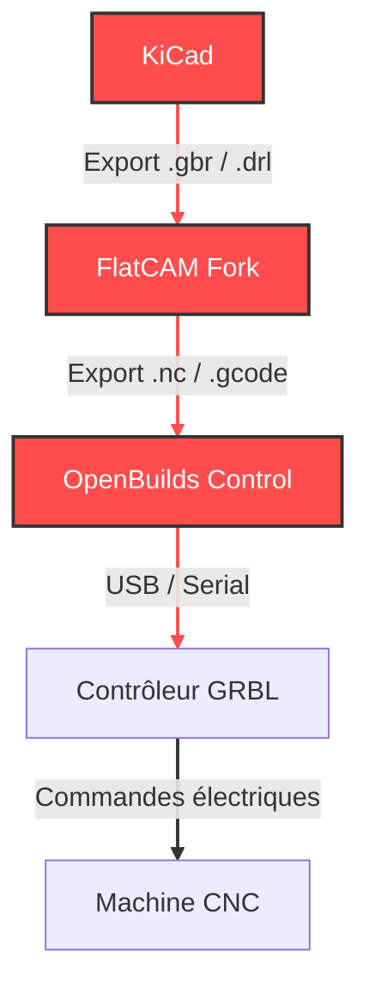

# Chaîne logicielle

Vue d'ensemble des logiciels qui composent la chaîne de traitement, de la conception à l'usinage.

## Rôle de chaque logiciel

| Logiciel | Rôle dans la chaîne |
|---|---|
| [KiCad](kicad.md) | Conception du PCB et export Gerber |
| [FlatCAM Fork](flatcam-fork/index.md) | Conversion Gerber → G-code, gestion des passes d'usinage |
| [OpenBuilds Control](openbuilds-control.md) | Interface de contrôle machine, envoi du G-code, GRBL |

## Flux de données

La chaîne logicielle représentes l'ensemble des blocs de couleur rouge du schéma du fonctionnement global ci-dessous.

--------------------------------------------------------------

[→ Première étape : KiCAD](kicad.md)

