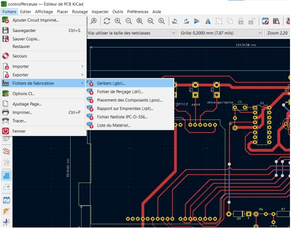
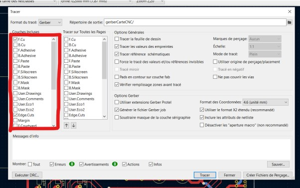
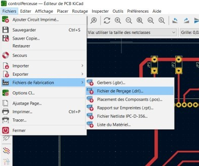
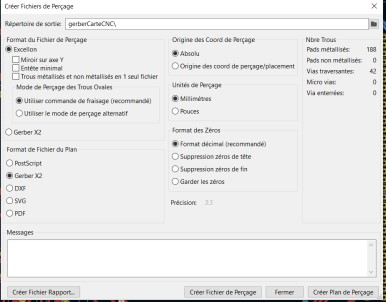

# KiCad

## Rôle

KiCAD est le logiciel de pédiléction dans le domaine de l'open source permettant de concevoir des cartes électroniques. Permettant d'éditer des schémas, de tracer des pistes et d'insérer des empreintes à taille réelle de composants électroniques, le logiciel intègre également des fonctionnalités de simulation des signaux électriques.

!!! quote "Extrait de [www.kicad.org](https://www.kicad.org/)"
    > **KiCad** is an open source software suite for Electronic Design Automation (EDA). The programs handle <u>Schematic Capture</u>, and <u>PCB Layout</u> with Gerber and <u>IPC-2581 output</u>. KiCAD is licensed under GNU GPL v3. 
    > The goal of the KiCad project is to provide the best possible cross platform electronics design application for professional electronics designers. Every effort is made to hide the complexity of advanced design features so that KiCad remains approachable by new and inexperienced users, but when determining the direction of the project and the priority of new features, the needs of professional users take precedence.
    ---

    **Source** : [About KiCad](https://www.kicad.org/about/kicad/) (consulté le 10 avril 2026)

## Installation

Pour l'installer, se rendre sur le [site officiel de KiCAD](https://www.kicad.org/), télécharger l'installateur pour windows.

## Guide d'export Gerber

### Règles générales de conception

De manière générale lors de la conception privilégiez les diamètres de vias  et pads les plus grands possibles pour de meilleurs tracés et un meilleur rendu d'usinage.

Avec la CNC il est possible d'usiner des PCB simple face ou double face au maximum.

Valeurs limites :

Diamètres pads et vias > 1,5mm
Diamètres trou > 0,7mm

### Fichiers à exporter

Afin de pouvoir usiner votre PCB il est nécessaire d'exporter tous les fichiers dans les bons formats.

Dans le cas le plus complet il vous faudra exporter :
- le fichier délimitant votre circuit (le contour)
- le fichier de routage de la couche supérieure de votre PCB
- le fichier de routage de la couche inférieure de votre PCB
- le fichier de perçage de votre PCB

### Paramètres d'export recommandés

Exportez les fichiers Gerber (.gbr) comme ci-dessous :

Fichiers> Fichiers de Fabrication> Gerbers (.gbr)

Il n'y a besoin d'exporter uniquement les fichiers de routages de la couche supérieure, inférieure et du contour en Gerber. Ces couches sont appelées respectivement `F.Cu`, `B.Cu` et `Edge.Cuts`. 
Sélectionnez les couches correspondantes dans la section "Couches Incluses" uniquement. 
Laissez les Options par défaut.

Exportez les fichiers de perçage de type Excellon (.drl) comme ci-dessous :

Fichiers> Fichiers de Fabrication> Fichiers de perçage (.drl)

Cliquez sur `Créer Fichier de Perçage` après vous être assuré que les bons paramètres soient cochés.

Gardez en tête que plus vos trous sont normalisés plus il sera simple d'usiner votre carte par la suite car il y aura moins de changement d'outils de perçage.

### Fichiers produits et leur usage dans FlatCAM

Sauvegardez bien ces fichiers exportés dans un même dossier dont vous connaissez l'emplacement.

Si vous ne concevez qu'un PCB simple face avec des trous de perçage vous devez avoir:
Les fichiers gerber `Edge_Cuts.gbr` et `F_Cu.gbr`. 
Les fichiers de perçage `...-NPTH.drl` et `...-PTH.drl` (Seul `...-PTH.drl` vous sera utile).

Si vous concevez un PCB double face vous aurez naturellement un fichier Gerber supplémentaire le `B_Cu.gbr`.

--------------------------------------------------------------

[→ Étape suivante : FlatCAM Fork](automated-flatcam/index.md)
