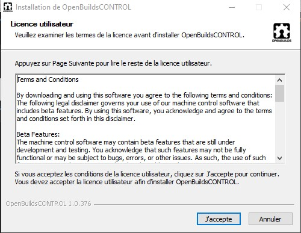
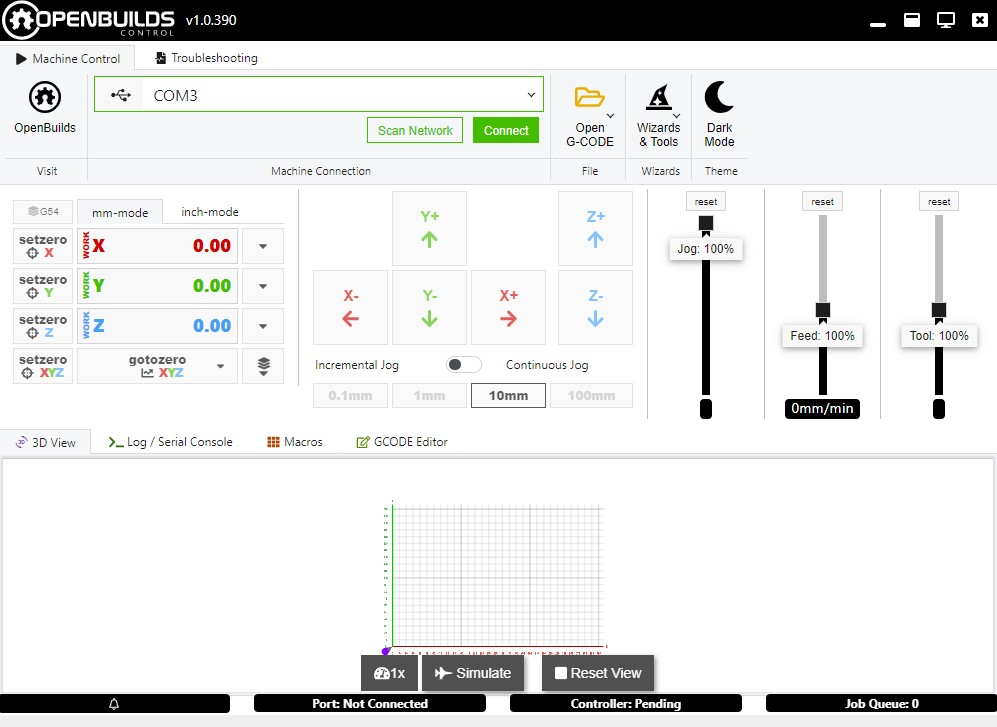
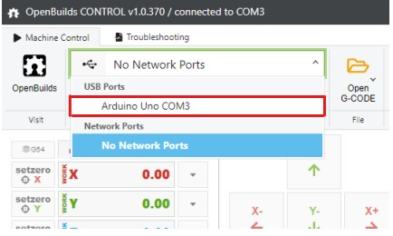
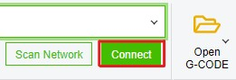
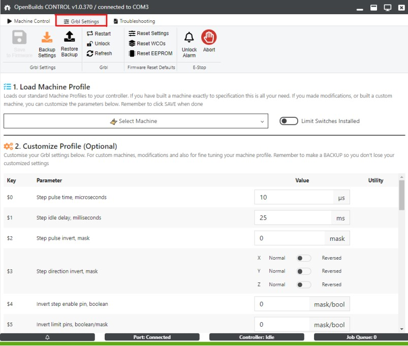
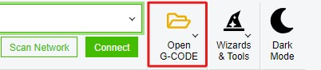
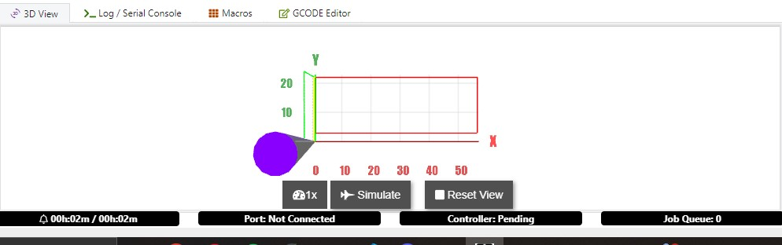

# OpenBuilds Control

## Rôle

OpenBuild Control est un logiciel gratuit développé par OpenBuild permettant de se connecter et de contrôler des CNC, machines Laser, Plasma ou autre.

C'est le logiciel que l'on utilise pour communiquer avec la CNC et lui envoyer des commandes.

!!! quote "Extrait de [https://software.openbuilds.com/](https://software.openbuilds.com/)"
    > **OpnBuild Control** OpenBuilds CONTROL is a FREE application for connecting to, and controlling, your CNC, Laser, Plasma or Dragknife machine. 
    > OpenBuilds CONTROL will allow you to :
        - Interface with, and Jog your machine
        - Run GCODE Jobs
        - Set Zero coordinates
        - Run Probing Operations
        - Integrate with cam.openbuilds.com
        - Flatten/Surface your spoilboard / stock
        - Calibrate your machine
        - Load Machine Profiles and customize Settings
        - Perform Firmware Updates
        - Design your own fully interactive Javascript Macro buttons
    ---

    **Source** : [OpenBuild software](https://software.openbuilds.com/) (consulté le 28 avril 2026)

## Installation

Pour installer `OpenBuild Control` sur votre ordinateur, rendez-vous sur ce site : [https://software.openbuilds.com/](https://software.openbuilds.com/).

Télécharger le dernièr installateur pour Windows puis double-cliquez sur l'installateur pour le lancer.

Suivez les étapes du programme en acceptant et laissant les paramètres par défaut.



## Connexion à la machine

Afin de pouvoir connecter OpenBuild Control à la CNC, il est nécessaire de connecter la carte de GRBL (actuellement une Arduino UNO dans le boitier de traitement des signaux) à votre pc. Pour cela munissez vous d'un câble USB-A vers USB-B. Branchez le port USB-B sur la face avant du boîtier de traitement des signaux de la CNC. Brancher le connecteur USB-A sur votre pc.

Ouvrez ensuite le logiciel OpenBuild Control. Vous devez normalement avoir cet affichage :



Dans la partie supérieure de la fenêtre cliquez sur le menu déroulant pour afficher la liste des Ports USB ouvert. Sélectionnez le port Arduino que vous venez de connecter.



Le numéro du port COM peut être différent.

Une fois sélectionné, cliquez sur le bouton `Connect`.



## Qu'est-ce que GRBL ?

!!! quote "Description de GRBL"
    > **Grbl** is a no-compromise, high performance, low cost alternative to parallel-port-based motion control for CNC milling. It will run on a vanilla Arduino (Duemillanove/Uno) as long as it sports an Atmega 328.
    The controller is written in highly optimized C utilizing every clever feature of the AVR-chips to achieve precise timing and asynchronous operation. It is able to maintain up to 30kHz of stable, jitter free control pulses.

    It accepts standards-compliant g-code and has been tested with the output of several CAM tools with no problems. Arcs, circles and helical motion are fully supported, as well as, all other primary g-code commands. Macro functions, variables, and most canned cycles are not supported, but we think GUIs can do a much better job at translating them into straight g-code anyhow.

    Grbl includes full acceleration management with look ahead. That means the controller will look up to 18 motions into the future and plan its velocities ahead to deliver smooth acceleration and jerk-free cornering.

    Licensing: Grbl is free software, released under the GPLv3 license.
    ---

    **Source** : [Grbl Project](https://github.com/grbl/grbl)

La carte Arduino au sein du boîtier de commande de la CNC est doté de GRBL. Ce logiciel nous permet d'envoyer des commandes g-code à la carte Arduino qui les traduits en signaux électriques pour commander les moteurs. 

GRBL est Open Source et sa licence permet de l'utiliser dans le cadre de la CNC.

Pour bien fonctionner le logiciel grbl a besoin d'un ensemble de paramètres propre au matériel comme le déplacement d'un pas d'un moteur pas à pas ou encore les dimansions de la table de perçage pour chaque axe. OpenBuild Control permet de renseigner ses paramètres et de les flasher sur la carte.

L'onglet suivant permet d'y accéder sur OpenBuild Control:



Si vous souhaitez apporter des modifications à ces paramètres, il vous suffit de modifier les valeurs puis de cliquer sur `Save to firmware` pour enregistrer ces paramètres au sein de grbl. 

OpenBuild Control permet également de redémarrer, verrouiller, rafraichir grbl mais aussi de sauvegarder un ensemble de paramètres (`Backup Settings`) pour pouvoir les charger à nouveau sur grbl (`Restore Backup` + `Save to Firmware`).

Pour plus d'information sur GRBL, ses supports et évolutions pour la CNC, voir la page [amélioration du grbl](../cnc/upgrades/grbl-hal-stm32.md). 

## Réglages GRBL importants

Vérifier donc que les paramètres grbl soient identiques à ceux ci-dessous :

```
$0=10  ;  Step pulse time, microseconds
$1=25  ;  Step idle delay, milliseconds
$2=0  ;  Step pulse invert, mask
$3=0  ;  Step direction invert, mask
$4=0  ;  Invert step enable pin, boolean
$5=0  ;  Invert limit pins, boolean/mask
$6=0  ;  Invert probe pin, boolean
$10=1  ;  Status report options, mask
$11=0.010  ;  Junction deviation, millimeters
$12=0.002  ;  Arc tolerance, millimeters
$13=0  ;  Report in inches, boolean (CONTROL needs $13=0)
$20=0  ;  Soft limits enable, boolean
$21=1  ;  Hard limits enable, boolean
$22=1  ;  Homing cycle enable, boolean (Grbl) / mask (GrblHAL)
$23=3  ;  Homing direction invert, mask
$24=25.000  ;  Homing locate feed rate, mm/min
$25=500.000  ;  Homing search seek rate, mm/min
$26=250  ;  Homing switch debounce delay, milliseconds
$27=1.000  ;  Homing switch pull-off distance, millimeters
$30=60000  ;  Maximum spindle speed, RPM
$31=0  ;  Minimum spindle speed, RPM
$32=0  ;  Laser-mode enable, boolean
$100=157.300  ;  X-axis steps per millimeter
$101=157.300  ;  Y-axis steps per millimeter
$102=143.000  ;  Z-axis steps per millimeter
$110=800.000  ;  X-axis maximum rate, mm/min
$111=800.000  ;  Y-axis maximum rate, mm/min
$112=800.000  ;  Z-axis maximum rate, mm/min
$120=10.000  ;  X-axis acceleration, mm/sec^2
$121=10.000  ;  Y-axis acceleration, mm/sec^2
$122=10.000  ;  Z-axis acceleration, mm/sec^2
$130=495.000  ;  X-axis maximum travel, millimeters
$131=395.000  ;  Y-axis maximum travel, millimeters
$132=34.000  ;  Z-axis maximum travel, millimeters
```

Pour gagner du temps, la sauvegarde des ces paramètres est disponible dans le dossier du projet (Le contenu est copiable ci-dessus).

## Guide d'utilisation

Cette partie décrit comment utiliser OpenBuild Control et pour mener à bien un usinage (PCB ou Géométrie)

### Chargement d'un fichier G-code

Cliquez sur Open gcode pour ouvrir un fichier Gcode.



Une fois ouvert vous devriez voir apparaître dans l'onglet 3D view la visualisation de votre usinage.

Vous pouvez vous déplacer sur la visalisation 3D en utilisant le clic droit, la molette ou encore le clic molette. Vérifiez visuellement que le tracé de l'outil correspond à ce que vous souhaitez usiner. Vous pouvez également lancer une simulation (Bouton `Simulate`).



### Préaparation de la CNC

A ce stade il est **impératif** de préparer le matériel et la CNC.

La page [guide d'utilisation cnc](../cnc/guide-utilisation.md) explique tout la démarche à avoir pour préparer le matériel.

### Mise à zéro des axes

Une fois avoir suivi les indication pour mettre en état de marche la CNC, il faut faire le 0 des axes.


### Lancement d'un usinage


→ Voir aussi : [Détecteur de surface Z](../cnc/upgrades/detecteur-z.md) pour la mise à zéro automatique de l'axe Z.
