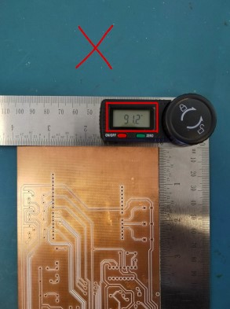
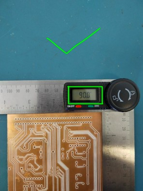

# Guide d'utilisation — Machine CNC

## Avant de commencer

→ Vérifiez que le G-code est prêt : [Guide FlatCAM Fork](../chaine-logicielle/flatcam-fork/guide-debutant.md)

→ Avoir Suivi les premières indications concernant [OpenBuild Control](../chaine-logicielle/openbuilds-control.md)

## Mise en route de la machine

Avant d'allumer quoi que ce soit, assurez vous d'avoir branché correctement l'ensemble du système.

La table de perçage doit être connectée au boîtier de commande des signaux par les trois câbles suivants.

Le boitier de commande doit être branché sur secteur.

Connecter le pc au boîtier de commande comme le montre la photo ci-dessous.

Vérifier ensuite la position de la spindle, que celle-ci ne soit pas encombrée, de même pour les 3 axes de déplacements de la CNC. 

## Préparation du plan de perçage

Ensuite, il vous faut fixer la plaque de cuivre à usiner, ou de bois le cas échéant. 

Vérifier que votre pièce est le plus à plat possible. 

Se munir d’une plaque de la bonne dimension. Les angles de la carte électronique doivent être a 90°. Si les angles ne sont pas à 90°, le circuit gravé sur la plaque ne sera pas très bien aligné avec la carte.
Cela peut surtout poser problème si il y a des connecteurs qui utilisent les bords de la carte.

### Fixation

Les fixations de votre carte sont essentielles pour deux raisons.

- Premièrement, celle-ci ne doit pas bouger pendant l'usinage sous peine d'apporter de l'imprécision pendant l'usinage. 
Vous pouvez utiliser du scotch double-face, les supports de fixation en aluminium ou autre pour garantir la bonne tenue de la carte.

- Deuxièmement, les fixations sont cruciales lorsque vous souhaitez réaliser des PCB doubles-faces. Puisque vous allez devoir retourner la carte pour usiner la face inférieure il est IMPERATIF d'avoir les trous d'alignement et un système de fixation garantissant l'alignement le plus précis possible. 
Je vous invite à voir la partie logiciel en lien avec le double face dans la [section d'opération de mise en miroir](../chaine-logicielle/automated-flatcam/guide-avance.md#calculer-les-valeurs-limites) ou la [section d'alignement](../chaine-logicielle/automated-flatcam/guide-avance.md#alignement-pcb) du guide avancé. 

## Mise à zéro des axes

La mise à zéro des axes se fait à l'aide du logiciel OpenBuild Control. Avant de se lancer sur la partie logicielle quelques vérifications matérielles peuvent être nécessaires:

D'abors, il faut vérifier visuellement la bonne connexion des fins capteurs de fin courses. Ces capteurs sont au nombres de 3 et servent à mettre à zéro les axes X et Y. L'axe Z est quant à lui au maxium quand son capteur de fin de course se déclenche.

Pour pouvoir faire le zéro de l'axe Z, il faut mettre en place le palpeur de détection de surface. Deux options:

- Premièrement, connecter la pince noire à la pointe de la perceuse et l'autre pince à la plaque de PCB. Dès que le contact sera établi entre le cuivre du PCB et la pointe de la CNC lors de la descente progressive de la pointe pour la détection de surface, le système s'arrête npous permettant de faire le zéro de l'axe Z.

- La deuxième option sera effective à posteriori. La détection de surface se fera à l'aide d'un palpeur monté sur ressord pour ne pas abîmer la pointe de tracé. Ce palpeur à une hauteur connu qu'il faudra alors soustraire sur OpenBuild Control avant de faire le zéro de cet axe.

→ Voir : [Détecteur de surface Z](upgrades/detecteur-z.md) pour la procédure automatique.

## Lancement de l'usinage

Le lancement de l'usinage se fait via le logiciel de contrôle OpenBuild Control.

## Surveillance pendant l'usinage

Pendant un usinage, il est impératif de rester attentif pour arrêter la machine (pause ou arêt d'urgence) dans les cas suivants :

- Descente anormale de la pointe par rapport à la surface du PCB,

- Problème mécanique ou blocage sur un ou plusieurs axe,

- Odeur anormale de brûler, fumée ou signe de départ d'incendie

- Tout autre comportement non contrôlé, anormal ou dangereux de la machine CNC.

## Arrêt d'urgence

L'arrêt d'urgence se fait en priorité via le logiciel Open Build Control à l'aide du boutons suivant:

Il est également possible d'arrêter en urgence la machine à commande numérique à l'aide d'un Bouton physique raccordé à la carte Arduino. Cette fonctionnalité étant en ajout veuillez consulter la page : [Amélioration : Ajout de l'arrêt d'urgence](./upgrades/arret-urgence.md).

## Après l'usinage

Après l'usinage, vous pouvez retirer la carte avec minutie, la nettoyer et la tester.

Il est vivement conseiller d'effectuer des tests visuels et ohm-métrique avant d'y souder vos composants pour prévenir de tout court-circuit. 

Maintenant que vous avez suivi ce guide d'utilisation et de préparation matériel de la machine vous pouvez revenir à [l'utilisation d'OpenBuild Control](../chaine-logicielle/openbuilds-control.md#mise-a-zero-des-axes) .