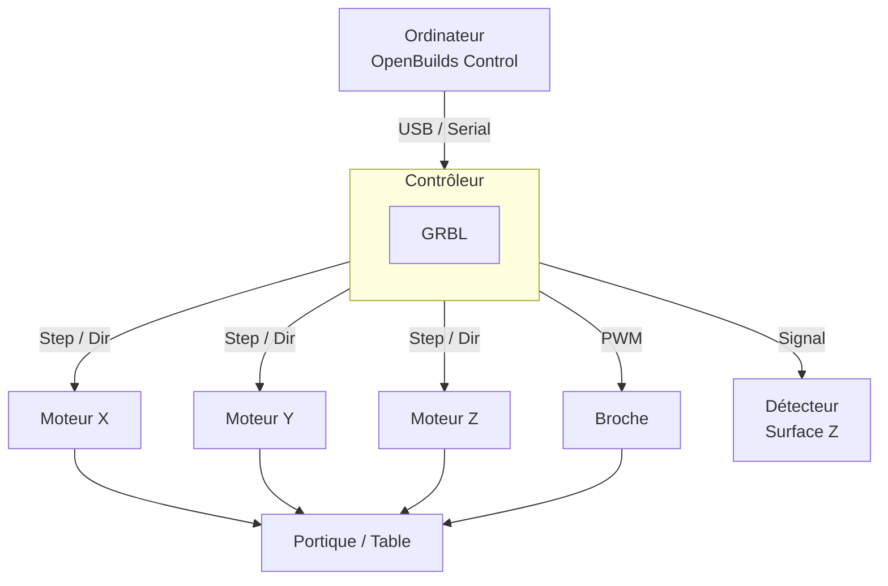

# Machine CNC

## Description générale

## Vue d'ensemble matérielle

> Cliquez sur un bloc ci-dessous pour accéder à sa fiche détaillée.

| Composant | Page détaillée |
|---|---|
| Moteurs pas à pas | [Upgrade moteurs](upgrades/moteurs.md) |
| Broche | [Upgrade broche](upgrades/broche.md) |
| Contrôleur GRBL HAL STM32 | [GRBL HAL pour STM32](upgrades/grbl-hal-stm32.md) |
| Détecteur de surface Z | [Détecteur de surface Z](upgrades/detecteur-z.md) |

---

## Dans cette section

| Page | Contenu |
|---|---|
| [Guide d'utilisation](guide-utilisation.md) | Procédures opérationnelles complètes |
| [Outils & Matériaux](outils-materiaux.md) | Choix des fraises, vitesses, matériaux usinables |
| [Mises à jour & Upgrades](upgrades/index.md) | Historique et détail de chaque modification matérielle |
