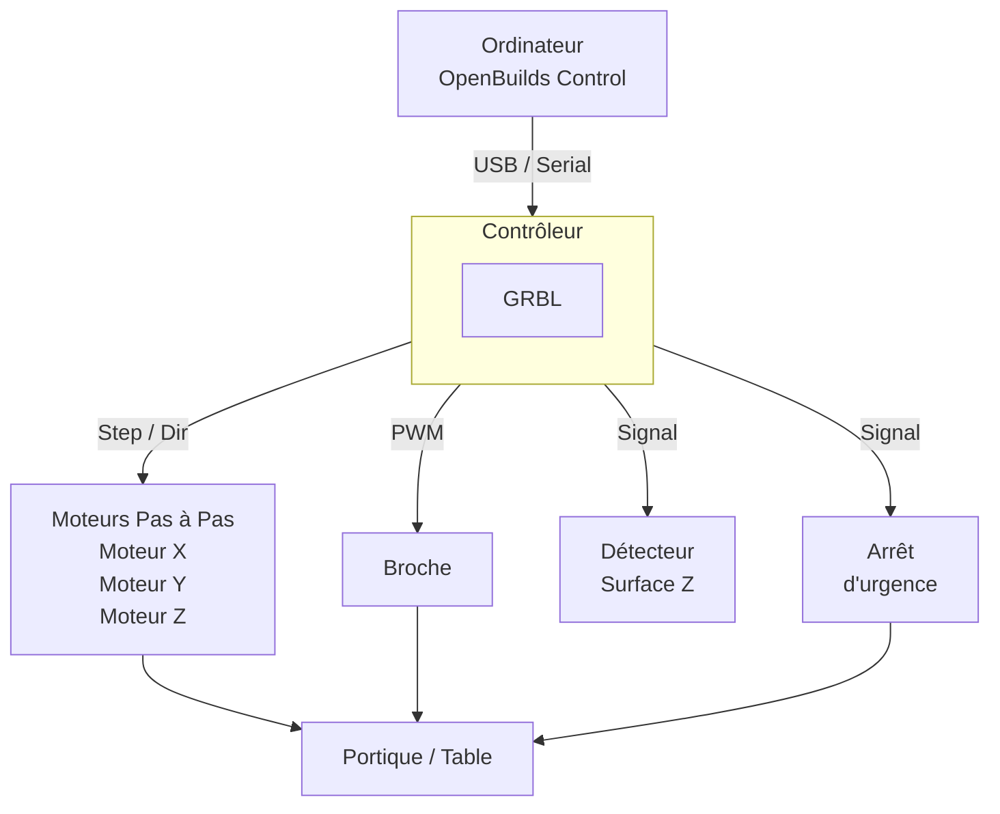

# Machine CNC

## Description générale

Cette partie de la documentation présente majoritairement le matériel et les différentes parties composant la cnc. La manière de préparer la machine et les procédures à suivre pour mener à bien un usinage sont également rassemblé dans cette partie.

Les différents outils d'usinage de la machine à commande numérique sont également détaillés ainsi que le calcul et le choix des paramètres associés.

Parce qu'une machine est sujette au vieillissement, les différentes améliorations, mécaniques et électriques sont également détaillées.

## Vue d'ensemble matérielle

La CNC comporte 3 organes:

- L'ordinateur envoyant les commandes d'usinage (GCODE) et assurant l'interface utilisateur
- Le boîtier de commande transformant les commande informatiques en signaux électriques controlant les moteurs
- La table de perçage avec les moteurs de chaque axe et la broche usinant directement le matériau.

> Cliquez sur un bloc ci-dessous pour accéder à sa fiche détaillée.

| Composant | Page détaillée |
|---|---|
| Moteurs pas à pas | [Upgrade moteurs](upgrades/moteurs.md) |
| Broche | [Upgrade broche](upgrades/broche.md) |
| Contrôleur GRBL HAL STM32 | [GRBL HAL pour STM32](upgrades/grbl-hal-stm32.md) |
| Détecteur de surface Z | [Détecteur de surface Z](upgrades/detecteur-z.md) |
| Système d'arrêt d'urgence  | [Bouton d'Arrêt d'urgence](upgrades/arret-urgence.md) |

---

## Structure de la documentation

Cette section regroupe 3 axes différents, le tableau ci-dessous vous permets de mieux vous y retrouver et trouver plus rapidement l'information qu'il vous faut.

| Page | Contenu |
|---|---|
| [Guide d'utilisation](guide-utilisation.md) | Procédures opérationnelles complètes |
| [Outils & Matériaux](outils-materiaux.md) | Choix des fraises, vitesses, matériaux usinables |
| [Mises à jour & Upgrades](upgrades/index.md) | Historique et détail de chaque modification matérielle |
